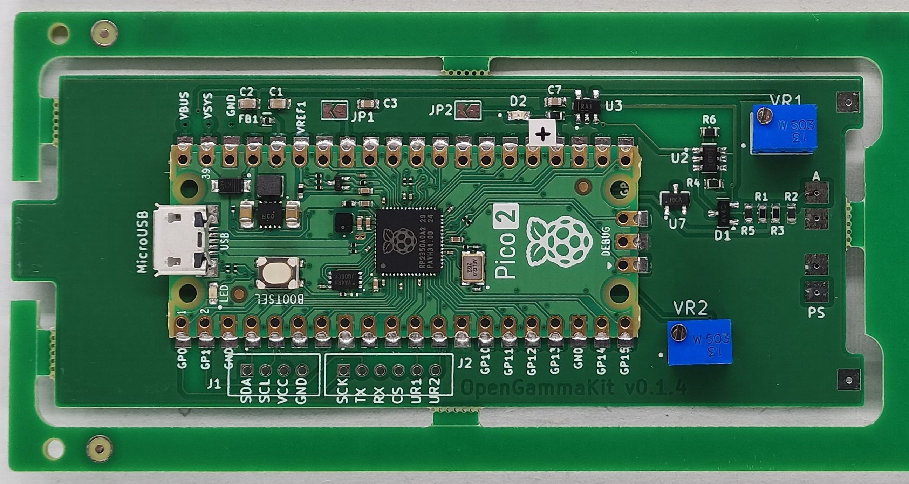

# OGK-Motherboard
OGK-Motherboard is the central carrier board of the OpenGammaKit Gamma-rays spectrometer

## PCB front and back side

<table>
  <tr>
    <td align="center">
      
       <b>Front view</b>
    </td>
    <td align="center">
      
       <b>Back view</b>
    </td>
  </tr>
</table>